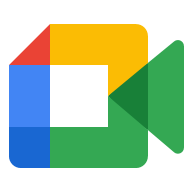
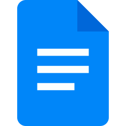

# Ferramentas

## Introdução

Para viabilizar a execução do projeto de análise do portal Hemocentro sob a ótica de IHC, a equipe selecionou um conjunto de tecnologias que facilitam a colaboração síncrona e assíncrona. A escolha dessas ferramentas visa otimizar o fluxo de trabalho, desde a comunicação interna até a prototipagem e documentação final, garantindo que os artefatos produzidos mantenham um padrão de qualidade e acessibilidade. A Tabela 1 detalha o ecossistema de software utilizado, especificando o papel de cada solução no ciclo de vida do projeto.

<b>Tabela 1</b> - Ferramentas Utilizadas no Projeto

|                         Logo                          |      Ferramenta       |                                                            Finalidade                                                             |
| :---------------------------------------------------: | :-------------------: | :-------------------------------------------------------------------------------------------------------------------------------: |
|                |        GitHub         |        Hospedagem do código-fonte, controle de versão e publicação da documentação via GitHub Pages.<a id="anchor_1" href="#FRM1">1</a>        |
|              |       Telegram        | Canal secundário para comunicação rápida e troca de arquivos com a equipe e o docente.<a id="anchor_2" href="#FRM2">2</a> |
|                  |         Google Meet         |              Realização de reuniões remotas, gravações de apresentações e chamadas de vídeo.<a id="3" href="#FRM3">3</a>               |
|                    |         Miro          |         Colaboração visual para criação de mapas mentais, fluxogramas e brainstorms iniciais.<a id="anchor_4" href="#FRM4">4</a>         |
|                  |         Figma         |          Desenho de interfaces, wireframes e prototipagem de alta fidelidade para IHC.<a id="anchor_3" href="#FRM3">5</a>           |
|                |        MkDocs         |                Framework para geração de sites de documentação técnica estática.<a id="anchor_4" href="#FRM4">6</a>                 |
|                |  Visual Studio Code   |              Ambiente de desenvolvimento principal para edição dos arquivos Markdown e YAML.<a id="anchor_5" href="#FRM5">7</a>              |
|              |       WhatsApp        |              Principal meio de comunicação instantânea e coordenação de tarefas diárias.<a id="anchor_6" href="#FRM6">8</a>              |
|                |        YouTube        |                  Armazenamento e compartilhamento público dos vídeos e apresentações do grupo.<a id="anchor_7" href="#FRM7">9</a>                  |
|          |   Google Planilhas    |                 Gestão do cronograma de atividades, controle de prazos e horários.<a id="anchor_8" href="#FRM8">10</a>                 |
|              |      Google Docs      |             Redação colaborativa e revisão de textos antes da transposição para o MkDocs.<a id="anchor_9" href="#FRM9">11</a>             |
|                |        ChatGPT        |              Suporte na pesquisa de conceitos, auxílio em scripts e revisão gramatical.<a id="anchor_12" href="#FRM10">12</a>              |
|                |        When2meet        |              Suporte na organização de horários entre o grupo.<a id="anchor_13" href="#FRM11">13</a>              |
|  | This Person Not Exist |              Geração de rostos via IA para ilustrar personas de forma ética e realista.<a id="anchor_14" href="#FRM12">14</a>              |
|                 |         Canva         |                 Criação de elementos visuais para apresentações e slides de suporte.<a id="anchor_15" href="#FRM15">15</a>                 |
|                 |        Capcut         |                    Edição e finalização dos vídeos de apresentações e entregas do projeto.<a id="anchor_16" href="#FRM16">16^</a>                   |
|                 |        Gemini         |                    Suporte na pesquisa de conceitos, auxílio em scripts e revisão gramatical.<a id="anchor_17" href="#FRM16">17^</a>                   |

Fonte: <a href="https://github.com/BrenoLTeixeira">Breno Teixeira (2026)</a>

## Referências Bibliográficas

> <a id="FRM1" href="#anchor_1">1.</a> GITHUB. GitHub Docs. [San Francisco, CA]: GitHub, c2025. Disponível em: <a href="https://docs.github.com/pt">https://docs.github.com/pt</a>. Acesso em: 10 abril 2026.
>
> <a id="FRM2" href="#anchor_2">2.</a> TELEGRAM MESSENGER. Telegram Web. [Dubai]: Telegram, c2025. Disponível em: <a href="https://web.telegram.org/k/">https://web.telegram.org/k/</a>. Acesso em: 10 abril 2026.
>
> <a id="FRM3" href="#anchor_3">3.</a> Google. Google Meet. [Mountain View, CA]: Google, c2025. Disponível em:<a href = "https://meet.google.com/">https://meet.google.com/</a>. Acesso em: 10 abril 2026.
>
> <a id="FRM4" href="#anchor_4">4.</a> MIRO. Miro. [San Francisco, CA]: Miro, c2025. Disponível em: <a href = "https://miro.com/pt/"> https://miro.com/pt/</a>. Acesso em: 10 abril 2026.
>
> <a id="FRM5" href="#anchor_5">5.</a> FIGMA. Figma. [San Francisco, CA]: Figma, c2025. Disponível em: <a href="https://www.figma.com">https://www.figma.com</a>. Acesso em: 10 abril 2026.
>
> <a id="FRM6" href="#anchor_6">6.</a> MKDOCS. MkDocs. [S.l.]: MkDocs, c2025. Disponível em: <a href = "https://www.mkdocs.org">https://www.mkdocs.org</a>. Acesso em: 10 abril 2026.
>
> <a id="FRM7" href="#anchor_7">7.</a> MICROSOFT. Visual Studio Code. [Redmond, WA]: Microsoft, c2025. Disponível em: <a href = "https://code.visualstudio.com">https://code.visualstudio.com</a>. Acesso em: 10 abril 2026.
>
> <a id="FRM8" href="#anchor_8">8.</a> META. WhatsApp. [Menlo Park, CA]: Meta, c2025. Disponível em: <a href ="https://www.whatsapp.com/?lang=pt_br">https://www.whatsapp.com/?lang=pt_br</a>. Acesso em: 10 abril 2026.
>
> <a id="FRM9" href="#anchor_9">9.</a> GOOGLE. How YouTube Works. [Mountain View, CA]: Google, c2025. Disponível em: <a href = "https://www.youtube.com/howyoutubeworks/">https://www.youtube.com/howyoutubeworks/</a>. Acesso em: 10 abril 2026.
>
> <a id="FRM10" href="#anchor_10">10.</a> GOOGLE. Google Planilhas. [Mountain View, CA]: Google, c2025. Disponível em: <a href = "https://www.google.com/intl/pt-BR/sheets/about">https://www.google.com/intl/pt-BR/sheets/about</a>. Acesso em: 10 abril 2026.
>
> <a id="FRM11" href="#anchor_11">11.</a> GOOGLE. Google Docs. [Mountain View, CA]: Google, c2025. Disponível em: <a href = "https://www.google.com/intl/pt-BR/docs/about">https://www.google.com/intl/pt-BR/docs/about</a>. Acesso em: 10 abril 2026.
>
> <a id="FRM12" href="#anchor_12">12.</a> OPENAI. ChatGPT. [San Francisco, CA]: OpenAI, c2025. Disponível em: <a href = "https://openai.com/index/chatgpt">https://openai.com/index/chatgpt</a>. Acesso em: 10 abril 2026.
>
> <a id="FRM13" href="#anchor_13">13.</a> WHEN2MEET. When2Meet. [Vancouver, BC]: When2meet, c2025. Disponível em: <a href = "https://www.when2meet.com/">https://www.when2meet.com/</a>. Acesso em: 10 abril 2026.
>
> <a id="FRM14" href="#anchor_14">14.</a> THIS PERSON DOES NOT EXIST. This Person Does Not Exist. [S.l.: s.n.], [20--?]. Disponível em: <a href = "https://thispersondoesnotexist.com/">https://thispersondoesnotexist.com/</a>. Acesso em: 10 abril 2026.
>
> <a id="FRM15" href="#anchor_15">15.</a> CANVA. Canva. [Sydney, AU]: Canva, c2025. Disponível em: <a href="https://www.canva.com/">https://www.canva.com/</a>. Acesso em: 10 abril 2026.
> <a id="FRM16" href="#anchor_16">16.</a> GOOGLE. Gemini. [Mountain View, CA]: Google, c2025. Disponível em: <a href="https://gemini.google.com/">https://gemini.google.com/</a>. Acesso em: 10 abril 2026.
>

## Histórico de Versões 

| Versão |    Data    |                        Descrição                         |                       Autor(es)                       |                        Revisor(es)                         |
| :----: | :--------: | :------------------------------------------------------: | :---------------------------------------------------: | :-------------------------------------------------------: |
| `1.0`  | 10/04/2026 |              Criação da página de ferramentas              | [Breno Teixeira](https://github.com/Brenolteixeira)  | [Pedro Américo](https://github.com/dev-americo)  |