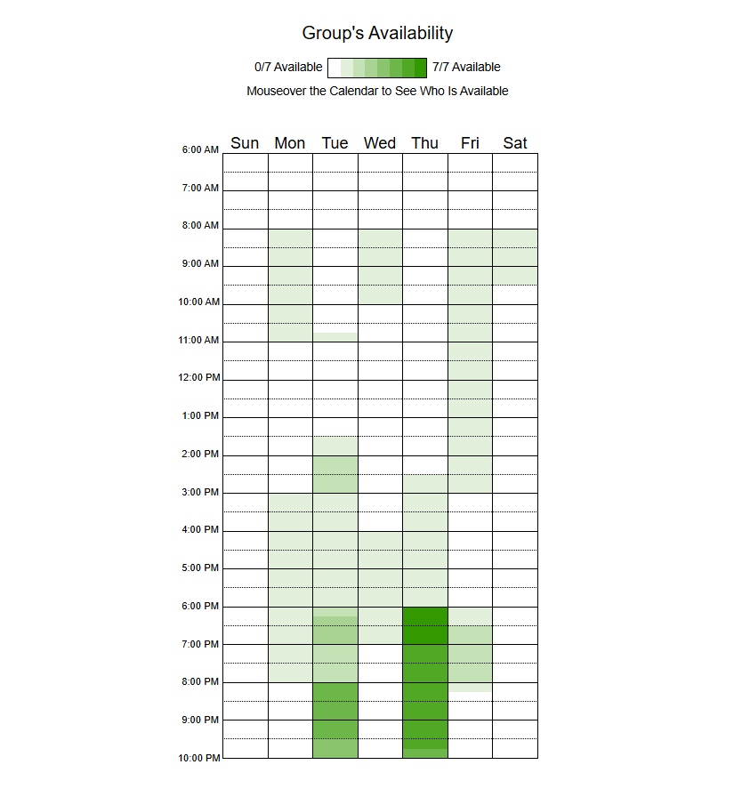

# Heatmap de Disponibilidade da Equipe

## Visão Geral

Este heatmap apresenta a **disponibilidade de horários dos membros da equipe ao longo da semana**, permitindo identificar os períodos com maior coincidência de horários livres para reuniões, desenvolvimento colaborativo e atividades do projeto.

A visualização facilita a tomada de decisão sobre **agendamento de reuniões**, **sprints colaborativas** e **momentos de revisão de código**.

## Heatmap de Disponibilidade

**Figura 1 – Disponibilidade semanal da equipe coletada através da ferramenta When2Meet.**

Fonte: Elaborado pelos autores.

## Descrição dos Dados

O heatmap foi construído a partir das informações de disponibilidade fornecidas pelos membros da equipe utilizando a ferramenta [When2Meet](https://www.when2meet.com/)[¹](#ref1).

Cada integrante acessou a plataforma e indicou os horários em que possui disponibilidade durante a semana. A ferramenta consolida automaticamente essas informações em um **mapa visual de disponibilidade**, onde cada célula representa um intervalo de tempo específico.

Os dados apresentados no heatmap consideram:

* **Colunas:** dias da semana
* **Linhas:** intervalos de horário ao longo do dia
* **Cores:** quantidade de membros disponíveis em cada horário

Quanto **maior a intensidade da cor**, maior é o número de integrantes disponíveis naquele período.

## Interpretação do Heatmap

A escala de cores representa o número de membros disponíveis:

| Intensidade       | Significado                         |
| ----------------- | ----------------------------------- |
| Cor clara         | poucos membros disponíveis          |
| Cor intermediária | disponibilidade moderada            |
| Cor escura        | maior número de membros disponíveis |

Dessa forma, os períodos mais escuros indicam **os horários mais adequados para atividades coletivas**.

## Metodologia de Construção

1. Foi criado um evento de disponibilidade na plataforma **When2Meet**[¹](#ref1).
2. Os membros da equipe acessaram o link e marcaram seus horários disponíveis.
3. A plataforma gerou automaticamente o **heatmap de sobreposição de horários**.
4. O resultado visual foi capturado/exportado e incluído na documentação do projeto.

## Referências Bibliográficas

> [1] WHEN2MEET. *When2Meet – Schedule a meeting*. Disponível em: <https://www.when2meet.com/>. Acesso em: 10 abr. 2026.

---

## Histórico de Versões

| Versão | Descrição | Data | Autor(es) | Data de revisão | Revisor(es) |
| :---: | :--- | :---: | :---: | :---: | :---: |
| 1.0 | Criação do documento Heatmap | 10/04/2026 | [Pedro Lucas](https://github.com/pwdrinho)| 10/04/2026 | [Gabriel Diniz](https://github.com/GabrielDiniz12)|
| 1.1 | Adição imagem do heatmap e referências | 10/04/2026 | [Pedro Lucas](https://github.com/pwdrinho)| 10/04/2026 | [Gabriel Diniz](https://github.com/GabrielDiniz12)|