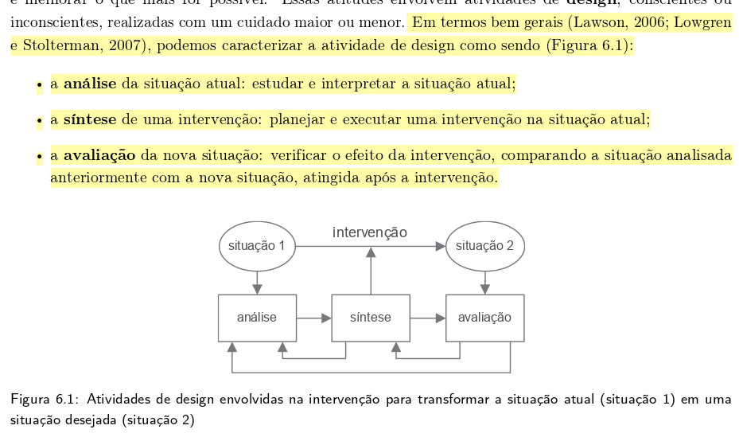
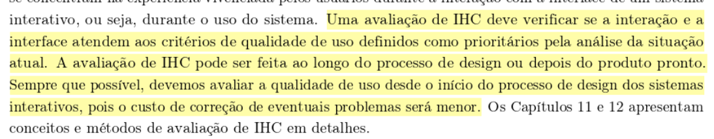
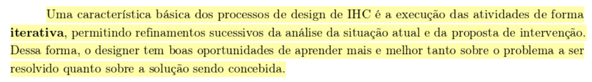
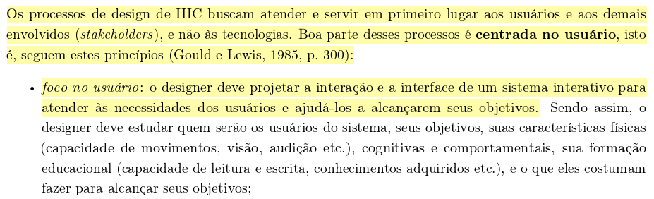
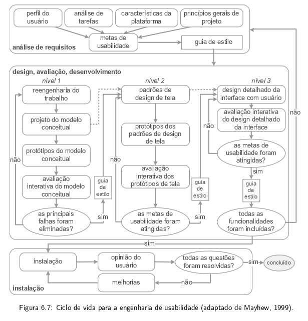
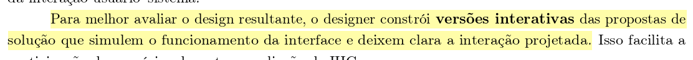
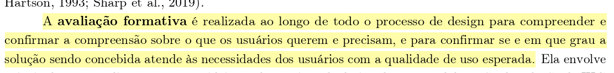

# Verificação da Entrega 1

## Introdução

A verificação de uma entrega é fundamental no desenvolvimento de um projeto, nesse momento que os artefatos criados são analisados para verificar se atendem aos requisitos especificados. Dessa forma, este documento detalha o planejamento e o relato da verificação dos artefatos desenvolvidos pelo [Grupo 4](../../index.md) na Etapa 1.

## Objetivo

Este documento tem como objetivo verificar se os artefatos desenvolvidos na Etapa 1 pelo [Grupo 4](../../index.md) estão em conformidade aos padrões esperados.

## Metodologia

A metodologia selecionada para esta verificação é a inspeção. Fundamentada na técnica proposta por Michael Fagan (IBM, 1976), esta análise formal visa a detecção precoce de defeitos nos artefatos. O procedimento estrutura-se no uso de checklists que contemplam os erros mais frequentes, permitindo a detecção, análise e categorização rigorosa de inconsistências. Conforme as boas práticas da técnica, a revisão é realizada por pares, garantindo que o autor não seja o revisor do próprio trabalho. Como produto final, os resultados serão consolidados e apresentados por meio de gráficos quantitativos.

## Participantes e Artefatos

os artefatos analisádos e os seus respectivos responsáveis por sua verificação estão descritos na tabela abaixo.

<b>Tabela 1</b> - Artefatos analisados e Participantes Responsáveis 

| Artefato | Responsável |
| --- | --- |
| Cronograma | [Breno](https://github.com/BrenoLTeixeira), [Gabriel Diniz](https://github.com/GabrielDiniz12), [Júlia Gabriella](https://github.com/juliagabriellafs), [Lucas Oliveira](https://github.com/dev-LucasDpaula), [Pedro Ian](https://github.com/pedroiaan), [Pedro Lucas](https://github.com/Pwdrinho) |
| Ferramentas | [Gabriel Diniz](https://github.com/GabrielDiniz12), [Júlia Gabriella](https://github.com/juliagabriellafs), [Lucas Oliveira](https://github.com/dev-LucasDpaula), [Pedro Américo](https://github.com/dev-americo), [Pedro Ian](https://github.com/pedroiaan), [Pedro Lucas](https://github.com/Pwdrinho) |
| Mapa de Energia | [Breno](https://github.com/BrenoLTeixeira), [Gabriel Diniz](https://github.com/GabrielDiniz12), [Júlia Gabriella](https://github.com/juliagabriellafs), [Lucas Oliveira](https://github.com/dev-LucasDpaula), [Pedro Américo](https://github.com/dev-americo), [Pedro Ian](https://github.com/pedroiaan) |
| Processo de Desing | [Breno](https://github.com/BrenoLTeixeira), [Gabriel Diniz](https://github.com/GabrielDiniz12), [Pedro Américo](https://github.com/dev-americo), [Pedro Ian](https://github.com/pedroiaan), [Pedro Lucas](https://github.com/Pwdrinho) |
| Sites Avaliados | [Breno](https://github.com/BrenoLTeixeira), [Gabriel Diniz](https://github.com/GabrielDiniz12), [Júlia Gabriella](https://github.com/juliagabriellafs), [Lucas Oliveira](https://github.com/dev-LucasDpaula), [Pedro Américo](https://github.com/dev-americo), [Pedro Lucas](https://github.com/Pwdrinho) |
| Site Escolhido | [Breno](https://github.com/BrenoLTeixeira), [Júlia Gabriella](https://github.com/juliagabriellafs), [Lucas Oliveira](https://github.com/dev-LucasDpaula), [Pedro Américo](https://github.com/dev-americo), [Pedro Ian](https://github.com/pedroiaan), [Pedro Lucas](https://github.com/Pwdrinho) |

Autor: [Pedro Américo](https://github.com/dev-americo), 2026

## Cronograma

A verificação foi realizada no dia 11/04/2026, a tabela 2 a seguir apresenta o cronograma da verificação de cada item.

<b>Tabela 2</b> - Cronograma de avaliação dos Artefatos

| Artefato | Data |
| --- | --- |
| Cronograma | 11/04/2026 |
| Ferramentas | 11/04/2026 |
| Mapa de Energia | 11/04/2026 |
| Processo de Desing | 11/04/2026 |
| Sites Avaliados | 11/04/2026 |
| Site Escolhido | 11/04/2026 |

Autor: [Pedro Américo](https://github.com/dev-americo), 2026

## Itens da avaliação de produção do Grupo

Seguindo o principio "quanto mais itens melhor", cada membro do grupo desenvolvel itens de verificação para que a avaliação seja o mais completa possível, essa seção trata da comprovação de que cada item tem um fundamento de exigência.

### Item 01

Este item foi desenvolvidor por [Júlia Gabriella](https://github.com/juliagabriellafs).

**Item:** O documento do Processo de Design explicita detalhadamente as três atividades básicas do design (Análise da situação atual, Síntese de intervenção e Avaliação)?

  
<strong>Figura 1</strong> - Comprovação do Item 01

  
  

  
Fonte: <a href="#1">(Barbosa et al., 2021, p. 94)</a>

### Item 02

Este item foi desenvolvidor por [Pedro Ian](https://github.com/pedroiaan).

**Item:** A página de Processo de Design justifica que a escolha do método e do ciclo de vida visa garantir especificamente a "qualidade de uso" (usabilidade/experiência do usuário) do sistema?

  
<strong>Figura 2</strong> - Comprovação do Item 02

  
  

  
Fonte: <a href="#1">(Barbosa et al., 2021, p. 96)</a>

### Item 03

Este item foi desenvolvidor por [Pedro Américo](https://github.com/dev-americo).

**Item:** O processo de design documentado no repositório deixa claro que o ciclo de desenvolvimento adotado pela equipe será executado de forma iterativa (com refinamentos sucessivos)?

  
<strong>Figura 3</strong> - Comprovação do Item 03

  
  

  
Fonte: <a href="#1">(Barbosa et al., 2021, p. 98)</a>

### Item 04

Este item foi desenvolvidor por [Breno](https://github.com/BrenoLTeixeira).

**Item:** O planejamento e o processo de design escolhido consideram explicitamente o "foco no usuário" (envolvimento, necessidades e objetivos) como princípio central do projeto?

  
<strong>Figura 4</strong> - Comprovação do Item 04

  
  

  
Fonte: <a href="#1">(Barbosa et al., 2021, p. 99)</a>

### Item 05

Este item foi desenvolvidor por [Pedro Lucas](https://github.com/Pwdrinho).

**Item:** O artefato de Processo de Design descreve rigorosamente as fases corretas do ciclo de vida escolhido pelo grupo (ex: as 3 fases de Mayhew, ou as atividades da Estrela)?

  
<strong>Figura 5</strong> - Comprovação do Item 05

  
  

  
Fonte: <a href="#1">(Barbosa et al., 2021, p. 106)</a>

### Item 06

Este item foi desenvolvidor por [Gabriel Diniz](https://github.com/GabrielDiniz12).

**Item:** O documento de Processo de Design prevê a elaboração de protótipos (mesmo que de baixa fidelidade) em suas etapas, para materializar as alternativas de design antes da implementação?

  
<strong>Figura 6</strong> - Comprovação do Item 06

  
  

  
Fonte: <a href="#1">(Barbosa et al., 2021, p. 100)</a>

### Item 07

Este item foi desenvolvidor por [Lucas Oliveira](https://github.com/dev-LucasDpaula).

**Item:** O texto do Processo de Design especifica que as avaliações ocorrerão durante a concepção da solução (avaliação formativa) para a correção rápida de problemas, e não apenas no final?

  
<strong>Figura 7</strong> - Comprovação do Item 07

  
  

  
Fonte: <a href="#1">(Barbosa et al., 2021, p. 251)</a>

## Checklist da Avaliação

A tabela abeixo lista todos os itens verificados, seus resultados e as suas respectivas data e hora de avaliação. Utilizamos como base os itens de verificação disponibilizados no plano de ensino e os confeccionados antes da inspeção pelos própris integrantes do grupo.

<b>Tabela 3</b> - Avaliação

| Item referente | Questão: O github pages possui: | Resposta (sim/não/incompleto) | Versão, data e horário da avaliação |
| :--- | :--- | :--- | :--- |
| Planejamento Geral do Projeto | Existe uma página apresentando os integrantes da equipe com foto, nome e sem matrícula? | sim - [integrantes](../../../#integrantes) | 1.0 - 11/04/2026 - 09:00 |
| Planejamento Geral do Projeto | O cronograma apresenta todas as atividades de todas as etapas para cada integrante, com as datas de início e fim das entregas e com o período de revisão? | sim - [cronograma](../../planejamento/cronograma.md) | 1.0 - 11/04/2026 - 09:04 |
| Planejamento Geral do Projeto | O cronograma prevê um período de gravação da apresentação de cada etapa? | sim - [cronograma](../../planejamento/cronograma.md) | 1.0 - 11/04/2026 - 09:08 |
| Planejamento Geral do Projeto | O cronograma prevê um período de revisão/ajustes nos artefatos após receber o feedback dos monitores/professor? | sim - [cronograma](../../planejamento/cronograma.md) | 1.0 - 11/04/2026 - 09:12 |
| Planejamento Geral do Projeto | A motivação e os critérios para a escolha do site estão documentados? | Sim - [Site Escolhido](../../planejamento/siteEscolhido.md) | 1.0 - 11/04/2026 - 09:16 |
| Planejamento Geral do Projeto | O planejamento e a avaliação dos sites candidatos estão presentes? | Sim - [Site Avaliados](../../../planejamento/sitesAvaliados/#avaliacoes-individuais) | 1.0 - 11/04/2026 - 09:20 |
| Planejamento Geral do Projeto | Possui opção de contraste de cores? | Sim - As cores são constrantes e possui modos de exibição "claro" e "escuro" | 1.0 - 11/04/2026 - 09:24 |
| Planejamento Geral do Projeto | Estão presentes todos os artefatos básicos exigidos: Planejamento do Projeto, equipe, lista de sites avaliados, site selecionado, Ferramentas, Processo de Design e cronograma das atividades? | Sim - [Planejamento](../../planejamento/cronograma.md)| 1.0 - 11/04/2026 - 09:29 |
| Planejamento Geral do Projeto | Uma página com as atas de reunião com o acesso a gravação (vídeo), quando houver. | Sim - [Atas](../../atas/ata1.md) | 1.0 - 11/04/2026 - 09:33 |
| Desenvolvimento do Projeto | O histórico de versão está padronizado? | Sim - As tabelas seguem colunas padronizadas de Versão, Descrição, Data, Autor(es), Data de Revisão e Revisor(es) | 1.1 - 11/04/2026 - 11:15 |
| Desenvolvimento do Projeto | O(s) autor(es) e o(s) revisor(es) estão indicados em cada artefato? | Sim - estão indicados no histórico de versões e no cronograma | 1.0 - 11/04/2026 - 09:41 |
| Desenvolvimento do Projeto | Referências bibliográficas e/ou bibliografia em todos os artefatos? | Sim - Seções de Referências Bibliográficas e Bibliografia distribuídas pela documentação | 1.0 - 11/04/2026 - 09:45 |
| Desenvolvimento do Projeto | As tabelas e imagens possuem legenda e fonte e elas chamadas dentro do texto? | sim - Os artefatos estão devidamente categorizadas e são citados no texto de forma direta e indireta | 1.0 - 11/04/2026 - 09:49 |
| Desenvolvimento do Projeto | Existe um texto fazendo uma introdução dos artefatos? | Sim - cada artefato possui um texto de Introdução | 1.0 - 11/04/2026 - 09:53 |
| Desenvolvimento do Projeto | Existe o cronograma executado com quem realizou cada artefato/atividade com as datas de início e fim da construção/realização do artefato/atividade? | sim - [Execução da Entrega 1](../../planejamento/cronograma.md#execucao-da-entrega-1-1204) | 1.1 - 11/04/2026 - 11:17 |
| Desenvolvimento do Projeto | As Atas de reuniões possuem data, horário de início e fim, participantes, objetivo e atividades definidas? | Sim - [Ata 1](../../atas/ata1.md) | 1.0 - 11/04/2026 - 10:02 |
| Desenvolvimento do Projeto | Há a gravação da reunião do grupo? | sim - [Apresentação da entrega 1](../../apresentacoes/entrega1.md) | 1.0 - 11/04/2026 - 10:06 |
| Desenvolvimento do Projeto | O vídeo de apresentação está acessível no youtube? Não deve estar na categoria “não listado” no YouTube | sim - [Apresentação da entrega 1 - Youtube]() | 1.0 - 11/04/2026 - 10:10 |
| Desenvolvimento do Projeto | Há uma Tabela de Contribuições com o nome de todos os integrantes, a contribuição exata de cada um e a hiperligação para a respectiva atividade e gravação, se houver? | sim - [Tabela de Atividades Desenvolvidas](../../tabelaAtividades.md) | 1.1 - 11/04/2026 - 11:25 |
| Desenvolvimento do Projeto | A seção de agradecimentos apresenta a declaração de uso de Inteligência Artificial (IA) Generativa? | sim - [Agradecimentos](../../../#agradecimentos) | 1.1 - 11/04/2026 - 11:28 |
| Conteúdo da Disciplina | Existe uma justificativa da escolha do Processo de Design? Essa justificativa deve conter a referência bibliográfica da fonte, foto do texto da referência e Autor(es) | sim - [Processo de Design](../../planejamento/processoDesign.md) | 1.0 - 11/04/2026 - 10:27 |
| Conteúdo da Disciplina | O documento do Processo de Design explicita detalhadamente as três atividades básicas do design (Análise da situação atual, Síntese de intervenção e Avaliação)? | sim - [Processo de Design](../../planejamento/processoDesign.md) | 1.0 - 11/04/2026 - 10:31 |
| Conteúdo da Disciplina | A página de Processo de Design justifica que a escolha do método e do ciclo de vida visa garantir especificamente a "qualidade de uso" (usabilidade/experiência do usuário) do sistema? | sim - [Processo de Design](../../planejamento/processoDesign.md) | 1.0 - 11/04/2026 - 10:34 |
| Conteúdo da Disciplina | O processo de design documentado no repositório deixa claro que o ciclo de desenvolvimento adotado pela equipe será executado de forma iterativa (com refinamentos sucessivos)? | sim - [Processo de Design](../../planejamento/processoDesign.md) | 1.0 - 11/04/2026 - 10:38 |
| Conteúdo da Disciplina | O planejamento e o processo de design escolhido consideram explicitamente o "foco no usuário" (envolvimento, necessidades e objetivos) como princípio central do projeto? | sim - [Processo de Design](../../planejamento/processoDesign.md) | 1.0 - 11/04/2026 - 10:45 |
| Conteúdo da Disciplina | O artefato de Processo de Design descreve rigorosamente as fases corretas do ciclo de vida escolhido pelo grupo (ex: as 3 fases de Mayhew, ou as atividades da Estrela)? | sim - [Processo de Design](../../planejamento/processoDesign.md) | 1.0 - 11/04/2026 - 10:48 |
| Conteúdo da Disciplina | O documento de Processo de Design prevê a elaboração de protótipos (mesmo que de baixa fidelidade) em suas etapas, para materializar as alternativas de design antes da implementação? | sim - [Processo de Design](../../planejamento/processoDesign.md) | 1.0 - 11/04/2026 - 10:51 |
| Conteúdo da Disciplina | O texto do Processo de Design especifica que as avaliações ocorrerão durante a concepção da solução (avaliação formativa) para a correção rápida de problemas, e não apenas no final? | sim - [Processo de Design](../../planejamento/processoDesign.md) | 1.0 - 11/04/2026 - 10:57 |

Autor: [Pedro Américo](https://github.com/dev-americo), 2026

## Gráfico dos itens de verificação da entrega

Os gráficos abaixo fazem a relação entre o resultado dos ítens de verificação antes e depois da inspeção.

Autor: [Pedro Américo](https://github.com/dev-americo), 2026

Autor: [Pedro Américo](https://github.com/dev-americo), 2026

## Referências Bibliográficas

 > 
 BARBOSA, Simone Diniz Junqueira et al. <b>Interação Humano-Computador e Experiência do Usuário</b>. 1. ed. Rio de Janeiro: Simone Diniz Junqueira Barbosa, 2021. E-book. 

 > 
 UNIVERSIDADE DE BRASÍLIA. Campus UnB Gama. **Plano de Ensino: Interação Humano Computador**. Professor: Dr. André Barros de Sales. Semestre 01/2026. Brasília, DF: UnB, 2026. Disponível em: <https://aprender3.unb.br/pluginfile.php/3335948/mod_resource/content/61/Plano_de_Ensino%20FIHC%20012026%20Turma%2003%20v2.pdf>. Acesso em: 11 abr. 2026.

## Histórico de Versões

| Versão | Descrição | Data | Autor(es) | Data de revisão | Revisor(es) |
| :---: | :--- | :---: | :---: | :---: | :---: |
| 1.0 | Avaliação da entrega 1 | 11/04/2026 | [Pedro Américo](https://github.com/dev-americo) | 11/04/2026 | [Gabriel Diniz](https://github.com/GabrielDiniz12) |
| 1.1 | Atualização após resolução de problemas | 11/04/2026 | [Pedro Américo](https://github.com/dev-americo) | 11/04/2026 | [Gabriel Diniz](https://github.com/GabrielDiniz12) |

